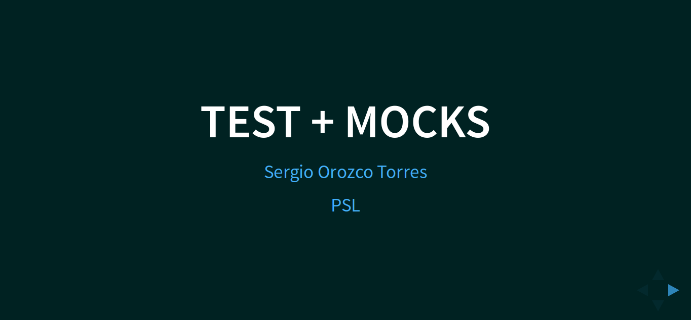

En la comunidad python Barranquilla tuve la oportunidad de presentar una charla acerca de

Como realizar la creación de pruebas unitarias usando sentinels mock y stubs

[Evento en meetup](https://www.meetup.com/es-ES/pythonbaq/events/237160306/)
